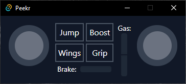

# Peekr

Real-time Information display app for [Distance](http://survivethedistance.com/).



Unlike simple input viewers, it also works when viewing replays, or when spectating other players in multiplayer. Note that, due to the way the game represents the data internally, the data shown will differ from the actual player inputs in several ways.

For the app to work, it requires a plugin to be installed in Distance.

## Download

**Prerequisite if you're on Windows 10 or earlier:** [WebView2 Runtime](https://go.microsoft.com/fwlink/p/?LinkId=2124703)

Download the latest version from [the releases page](https://github.com/Seeker14491/Peekr/releases). Only a Windows x64 build is provided for now, though the code is cross-platform.

## Usage

To get the plugin working you'll first need to get the BepInEx modding framework installed in Distance. On Windows, you just download the latest version from the [BepInEx release page](https://github.com/BepInEx/BepInEx/releases), specifically the file with a name like `BepInEx_x86_x.x.x.x.zip`, and then extract the contents of the zip next to `Distance.exe` in your game install directory. Refer to ([the docs](https://docs.bepinex.dev/master/articles/user_guide/installation/index.html)) if you need clarification, or for other platforms.

Note that [Centrifuge](https://github.com/Ciastex/Centrifuge) conflicts with BepInEx. If you experience issues getting BepInEx working, it might be due to some files left from a previous Centrifuge install. To fix this, delete the `Distance_Data/Managed` folder from your game directory, then verify the game through Steam. [Spectrum](https://github.com/Ciastex/Spectrum), works fine alongside BepInEx.

Install the plugin by placing the `PeekrPlugin` directory inside the `Distance/BepInEx/plugins/` directory, such that your directory structure ends up looking like `Distance/BepInEx/plugins/PeekrPlugin/PeekrPlugin.dll`.

The plugin can be configured by editing the configuration file `Distance/BepInEx/config/pw.seekr.plugins.peekr.cfg`, which will be generated after running the game with the plugin installed.

Once the plugin is installed you can run the app which will show data once you're in-game.

**Note:** If the app just closes shortly after opening it, and you're on Windows, you're probably missing the prerequisite linked in the download section above.

## Architecture

The game plugin continually collects telemetry from the running game and sends it over UDP as JSON to the GUI application. The GUI is implemented with [SvelteKit](https://kit.svelte.dev/) + [Tauri](https://tauri.studio/).

## Building the plugin

Before building the plugin, you'll need to copy these dll files from your game folder to the `PeekrPlugin/Libs` directory (this assumes you have BepInEx installed in your game already):

- `Distance_Data/Managed/Assembly-CSharp.dll`
- `Distance_Data/Managed/UnityEngine.dll`
- `BepInEx/core/0Harmony.dll`
- `BepInEx/core/BepInEx.dll`

The plugin can then be built by building the solution in the `PeekrPlugin` folder.

## Building the UI

You'll need to set up your system for Tauri; see [the Tauri docs](https://tauri.studio/en/docs/getting-started/intro). You'll also need [Yarn](https://yarnpkg.com/) installed.

To build the UI, inside the `peekr-ui` directory run:

```
yarn tauri build
```

The build output will be in the `peekr-ui/src-tauri/target/release` directory.

Alternatively, the script `windows_tiny_build.ps1` in the `peekr-ui` folder can be used to build for windows, making use of a few extra tricks to get a smaller binary size. It requires [UPX](https://upx.github.io/) being available on the command line.

## Credits

The layout was inspired by the [Distplay](https://github.com/Californ1a/distplay) input viewer.
